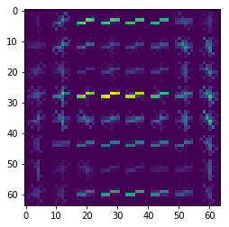
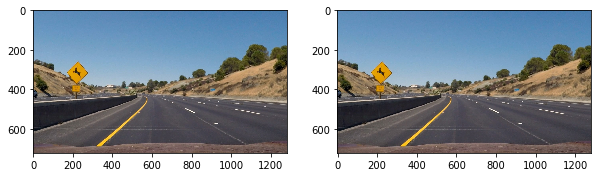
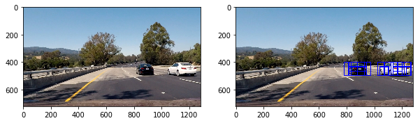
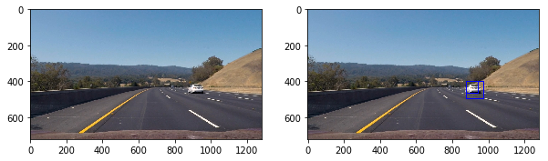

## Vehicle Detection
#### Udacity Project
----------------------------------------------------------------------------------------------------------------------

This project is for the final project for term1 of Udacity CarND program. In this Project I have detected cars in the video provided to me.

### Histogram of Oriented Gradients (HOG)

#### Explain how (and identify where in your code) you extracted HOG features from the training images. Explain how you settled on your final choice of HOG parameters.

By trying various color channel for the HOG ,  I finally seleted on the Y channel of the YCrCb. The code for HOG feture extraction is in the second cell block in the Ipython note I have submitted along with this read me.

#### Describe how (and identify where in your code) you trained a classifier using your selected HOG features (and color features if you used them).

I have taken spatial, histrogram and hog features of the image and combined them into a single feature. I have normalised this at code block[5] in lines 20-22 where I have used a  standard scaler to scale the video to a zero mean and unit variance. I have used a non-linear RBF Support Vector Machine with a smothness value of 5. (see Code block 6)

### Sliding Window Search

#### Describe how (and identify where in your code) you implemented a sliding window search. How did you decide what scales to search and how much to overlap windows?

The fucntion for sliding window is at the Cell 2 in my Ipython notebook. I have used 2 windows to effectively identify cars. I have used a smaller window of size 64,64 to identify the further away cars and a 96,96 window to indentify both large and medium cars. I found 2 windows to be working well for my model therefore I didnt use a thrid window. I also have an overlap of 0.5 as I wanted to have a balance between identifying everything in the picture and having a good performance.

#### Show some examples of test images to demonstrate how your pipeline is working. How did you optimize the performance of your classifier?

I optimized my classifier by using C as 5. I manually tried various values for C and gamma and found default value for gamma and C as 5 gave me an accuracy of 99.4%.

### Video Implementation

#### Provide a link to your final video output. Your pipeline should perform reasonably well on the entire project video (somewhat wobbly or unstable bounding boxes are ok as long as you are identifying the vehicles most of the time with minimal false positives.)

The final output for this project can be found at [Here](./project_video.mp4)
Kindly open the video on the folder if the link isnt working. 

#### Describe how (and identify where in your code) you implemented some kind of filter for false positives and some method for combining overlapping bounding boxes.

I have filtered out false positives by taking the heatmap of past 10 frames in a que and am taking a sum of all the heatmaps and then thersholding it with a value of 6. The primary reason for perfering sum over mean is, I am pretty confident that the same false positive may not occur in more than two frames while a car is detected if it is at a particular pixel for 6 frames. Such flexibility isn't present while using mean function. Once the heatmap is found, I used labels to convert the heatmap into boxes and then draw them onto the pictures.

### Discussion

#### Briefly discuss any problems / issues you faced in your implementation of this project.  Where will your pipeline likely fail?  What could you do to make it more robust?

I beleive my pipeline may fail to detect a truck or a bus. I think the model can be made more robust be inculding other classes of object such as trucks,bus,people instead of just cars and take action separately for each class.
